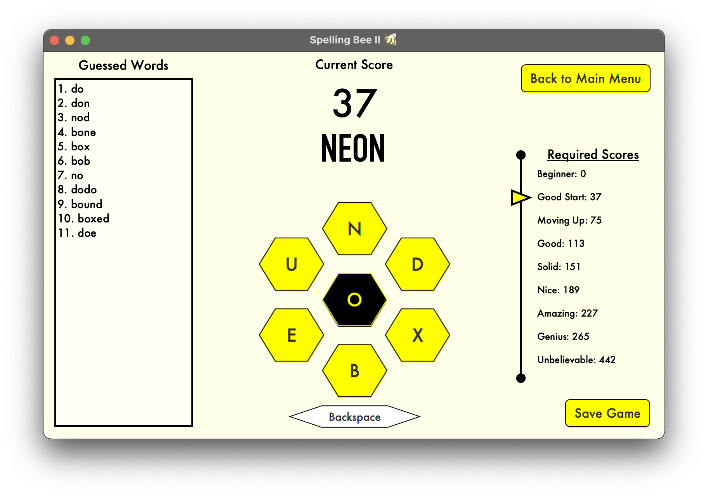

# Spelling-Bee-II
## GUI word game based on the New York Times "Spelling Bee" puzzle

Can be run in JetBrains Intellij IDE. The [Java Runtime Environment](https://www.oracle.com/java/technologies/javase-jdk15-downloads.html) and [JavaFX SDK](https://gluonhq.com/products/javafx/) must be installed and correctly interfaced with Intellij. For reference on this last step, see [this article](https://www.jetbrains.com/help/idea/javafx.html#add-javafx-lib).

The following are screenshots of the running program*.
  
 
 
